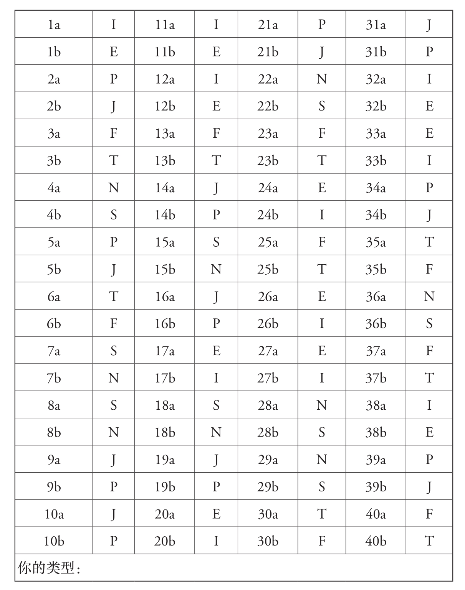
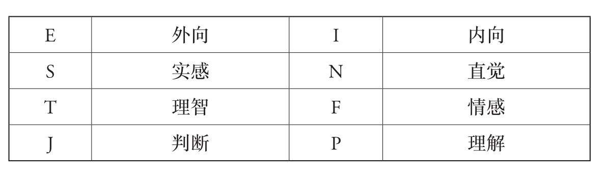

## MBTI 人格测试

[TOC]

要找出你是哪种类型，可以做一做下面几页的测试。我的经验是，只要“诊断”得对，也就是说，只要对各个维度的自我评估都正确，个人的性格画像就会很准。

具体来说：如果某人评估自己是外向型（E）、直觉型（N）、情感型（F）、判断型（J），那么只有当他的确是ENFJ，而非ENTJ或ENTP时，画像才会准。正确地评估自己，对有的人来说很容易，对有的人来说就难一点。重要的是，不要自己想当然。犹豫不决的时候可以请伴侣或好朋友评价一下。如果测试的结果还不到2分，那就不对。准的结果所描述的特点通常有90%的命中率。

除正确的自我评估外，还会出现另一个问题，那就是你是一个混合型。虽然一个人在每个维度上都处于中间位置的情况不多，但在一个，有时甚至是两个维度上位于中间的情况并不少见。例如，如果不确定自己是ISFJ还是INFJ，那就读一读两种画像的描述，看看哪一个更符合。如果还是拿不定主意，那你真的就是混合型。

每个问题都有两个答案可选。**请尽可能凭直觉选择其一，选择第一眼看上去最符合你的答案。**别忘了，这些问题旨在捕捉偏好或倾向。通常，这两个选项并不相互排斥，所以你可能会觉得很难做出决定。因此，问问自己，两个可能的答案中你更偏爱哪一个，选择那个更吸引你的选项。

对于某些问题，你的答案可能会不一样，全看你考虑的是工作还是私生活。**这时，请参考你的私生活来作答，私生活中的行为方式应该更符合你的倾向。**如果你在生活中努力训练过自己的某种行为方式（如整洁），那么请勾选那个能描述你最初行为的选项（如不整洁）。该测试旨在衡量你的核心人格，而不是你所学到的东西。

**如果真的选不出来，就干脆跳过这个问题，但这应该只是例外。**

最好把答案另写在一张纸上（1a、2b等），这样就可以测很多次而不受干扰，其他人也能来测。此外，这样更容易打分。现在，好好玩吧！

### 一、测试题目

1. 更符合我的陈述是　　　。

   a. 有时我想了很久，却什么也没说。

   b. 我说话的速度经常比我想的要快。

2. 长期计划让我觉得　　　。

   a. 受到束缚。

   b. 让一切尽在掌控之中。

3. 更符合我的陈述是　　　。

   a. 我对身边人的情绪很敏感。

   b. 错误立即引起我的注意。

4. 需要耐心和细心的工作，我觉得如何？

   a. 对我来说更像是一种折磨。

   b. 大多数让我感到开心。

5. 更符合我的陈述是　　　。

   a. 工作和休闲对我来说并没有那么清楚地分开。

   b. 先工作，再玩耍。

6. 在关系中，我非常重视　　　。

   a. 真相和公平。

   b. 和谐与同理心。

7. 当我修修补补或做手工时，　　　。

   a. 我仔细而准确。

   b. 我更多是凭感觉和估计。

8. 如果必须选择，我宁愿将自己描述为　　　。

   a. 现实主义者。

   b. 理想主义者。

9. 更符合我的陈述是　　　。

   a. 我家里一切都井然有序。

   b. 我家里有种“创造性的混乱”。

10. 我的优势更多在于　　　。

    a. 安排得井井有条。

    b. 灵活应对意外情况。

11. 在公司时，　　　。

    a. 我听得多。

    b. 我很喜欢说。

12. 有问题时，　　　。

    a. 我很少说，就算说也只告诉几个人。

    b. 我藏不住话。

13. 我宁愿　　　。

    a. 被叫作有感情的人。

    b. 被叫作有头脑的人。

14. 等客人时，　　　。

    a. 我通常在客人到来前一刻钟完成准备工作。

    b. 第一个客人到达时，我还在准备。

15. 我有　　　。

    a. 对细节的良好感知。

    b. 对细节的拙劣感知。

16. 更符合我的陈述是　　　。

    a. 我想在星期一就知道周末有什么计划。

    b. 我宁愿等着看周末能干啥。

17. 我最好的充电方式是　　　。

    a. 在熟悉的圈子里放松。

    b. 有时间独处。

18.  更符合我的陈述是　　　。

     a. 我会读新设备的使用说明。

     b. 迫不得已时，我才读使用说明。

19. 让我很烦的是　　　。

    a. 有人说话不算话。

    b. 有人不懂变通。

20. 更符合我的陈述是　　　。

    a. 我的情绪大多数时候写在脸上。

    b. 其他人不太容易看得出我心里在想什么。

21. 更符合我的陈述是　　　。

    a. 我经常在最后一分钟完成工作。

    b. 我通常能很好地管理自己的时间。

22. 我宁愿有　　　。

    a. 哲学的天赋。

    b. 一种实际的才能。

23. 必须做出决定时，我会在有疑问时依靠　　　。

    a. 我的感觉。

    b. 客观事实。

24. 与他人长时间相处时，　　　。

    a. 我不觉得累。

    b. 我经常觉得很累。

25. 我更喜欢　　　的工作。

    a. 需要社交技巧和同理心。

    b. 需要理性行动和分析思维。

26. 与一群朋友一起旅行时，　　　。

    a. 我几乎可以一直身边有人。

    b. 我不时地需要独处的时间。

27. 更符合我的陈述是　　　。

    a. 我通常让我的想法和感受脱口而出。

    b. 在我输出想法和感受之前，我通常会想很久。

28. 更符合我的陈述是　　　。

    a. 我经常思考未来及其可能性。

    b. 我的想法更多的是关注此时此地。

29. 我更喜欢的工作领域是　　　。

    a. 其中需要许多新概念。

    b. 准确性和事实性知识很重要。

30. 下面的表达方式，　　　更适合我。

    a. 严厉但公平！
    b. 情大于法。

31. 更符合我的陈述是　　　。

    a. 我通常会很快就去处理不愉快的事情，想赶紧摆脱。

    b. 我经常把不愉快的事情拖了又拖。

32. 其他人会形容我为　　　。

    a. 腼腆而安静。

    b. 健谈而开放。

33. 更符合我的陈述是　　　。

    a. 我相当自然而强烈地体验我的感受。

    b. 我不太容易情绪化。

34. 在　　　情况下，我的工作效率最高。

    a. 最后，时间紧迫。

    b. 提前，当我知道我还有足够的时间时。

35. 我更喜欢　　　。

    a. 谈论事实话题。

    b. 谈论人际关系。

36. 更符合我的陈述是　　　。

    a. 我喜欢思考“生活中的大问题”。

    b. 我更喜欢关注具体的东西。

37. 我更可能会　　　。

    a. 不怎么坚持我的立场。

    b. 惹人生气。

38. 在空闲时间，我倾向于选择　　　。

    a. 看一本好书或一部好电影。

    b. 社交活动或谈话。

39. 我更可能的工作方式是　　　。

    a. 爆发一股猛劲。

    b. 有纪律，有条理。

40. 更符合我的陈述是　　　。

    a. 我很容易被冒犯。

    b. 我心大。

### 二、结果评估

 

“1a=I”的意思是，1a的问题“有时，我想了很久，却什么也没说”包含着内向型的偏好。

根据这个表，你现在就可以把你的每个答案归入合适的类型。每个答案都算1分。

比如，如果第十六题你选了a，这就为偏向判断型加了1分。如果选了b，就是为偏向理解型加了1分。

如果你两个都选，或者都没选，这道题就不得分。

最后，算算八种类型中每一种的分值，你的类型画像就是你自己在四个心理维度上的类型的总和（E或I，S或N，T或F，J或P）。

在理想情况下，你现在有一张纸，上面记下了你选择的答案。你将在下面找到一个列表，该列表将各个测试问题分配给要记录的特征。

 

如果你在某个或某些维度上得分很低，我建议你读一读其他画像的描述。比如，如果你的外向是6分（与之相应，内向有5分），按这个结果你是ENFJ，那就再读一读INFJ，因为在这个维度你处于“边界”上。**无论如何，最符合你的测试结果才是对的。**

